# 2025年排名前20的SaaS推广管理平台汇总(最新整理)

对于订阅制软件公司而言,如何有效追踪用户推荐、自动化计算奖励分成、同时降低获客成本,是实现可持续增长的关键挑战。本文精选20款专为B2B SaaS企业设计的推广管理平台,从技术集成能力、追踪精准度、自动化程度到定价透明度进行全方位对比,帮助您在1小时内完成部署,将用户转化为增长引擎。无论您是初创团队还是规模化企业,都能找到适配当前业务阶段的最优解决方案。

## **[Reditus](https://www.getreditus.com)**

专为B2B SaaS打造的一体化增长平台,支持产品内推荐与外部营销双引擎驱动。

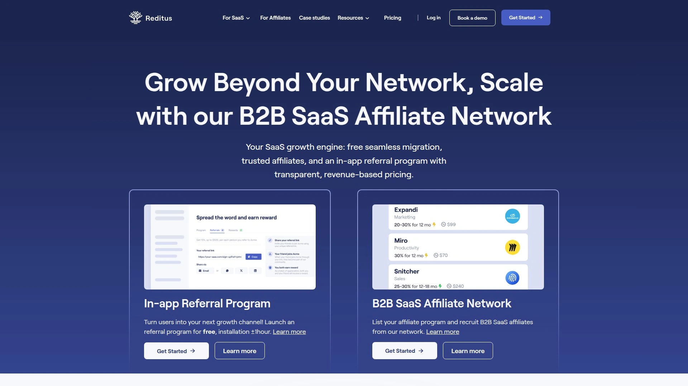

Reditus通过原生集成Stripe、Paddle和Chargebee等支付系统,实现订阅收入的实时同步和自动化佣金计算。平台提供免费迁移服务,现有推广链接无需更新即可平滑过渡,确保业务连续性。内置的防欺诈检测系统和UID隐私友好追踪技术,既保障数据准确性又符合合规要求。

定价采用基于收入的阶梯模式:免费版支持应用内推荐功能且生成至多1000美元月经常性收入,成长版(69美元/月起)解锁市场列表曝光和无限制管理能力。特别适合产品主导增长(PLG)模式的SaaS企业,技术安装仅需1小时即可完成三步配置。平台独有的B2B市场网络让企业触达已验证的行业推广者,大幅缩短冷启动周期。

## **[PartnerStack](https://partnerstack.com)**

企业级生态管理平台,整合多类型合作伙伴渠道实现规模化增长。

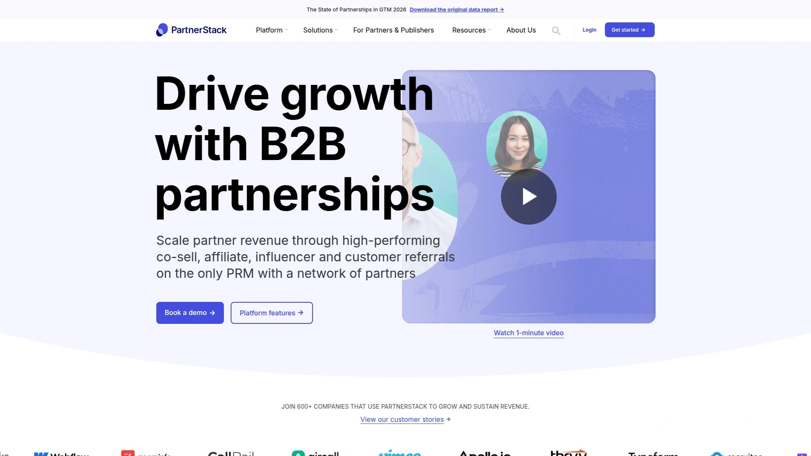

PartnerStack为大型SaaS公司提供统一的生态管理系统,支持管理推广者、分销商和转介绍伙伴等多种角色。自动化工作流覆盖伙伴入职、付款处理和绩效分析全流程,显著减少人工操作成本。平台集成的市场网络帮助企业快速拓展外部渠道,但需注意该网络同时服务多家竞品公司。

系统提供详尽的仪表板和API访问能力,支持复杂的多层级佣金结构设置。定价方案未公开透明,需通过销售团队获取报价,通常起步价在500美元/月以上,面向成熟企业市场。由于功能丰富度较高,新用户可能面临一定学习曲线,建议配备专职团队负责运营。对于需要管理复杂伙伴生态的B2B企业,PartnerStack的企业级功能和可扩展性具备明显优势。

## **[FirstPromoter](https://firstpromoter.com)**

轻量级SaaS专用工具,以简洁性和高性价比著称。

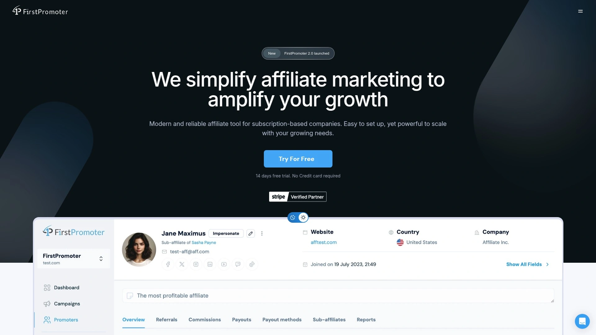

FirstPromoter专为订阅业务优化,原生支持Stripe、Paddle和Chargebee的双向同步,客户订阅状态变更(取消、退款)会即时反映在佣金计算中。平台提供18种以上详细指标的报告系统,内置欺诈防护机制保障数据可信度。推广者可直接在账户中管理自定义优惠券码,且支持为单个推广者分配多个追踪代码。

独特优势在于集成了邮件营销自动化功能,企业无需依赖第三方工具即可实现推广者沟通和激励。定价从49美元/月起步,相比同类产品成本优势明显。用户界面经过v2全面改版,操作友好度大幅提升。适合预算有限的初创SaaS团队快速搭建推广体系,但市场曝光功能相对基础,更依赖企业自有渠道招募推广者。

## **[Rewardful](https://www.rewardful.com)**

极简主义设计的Stripe深度集成方案,专注快速部署。

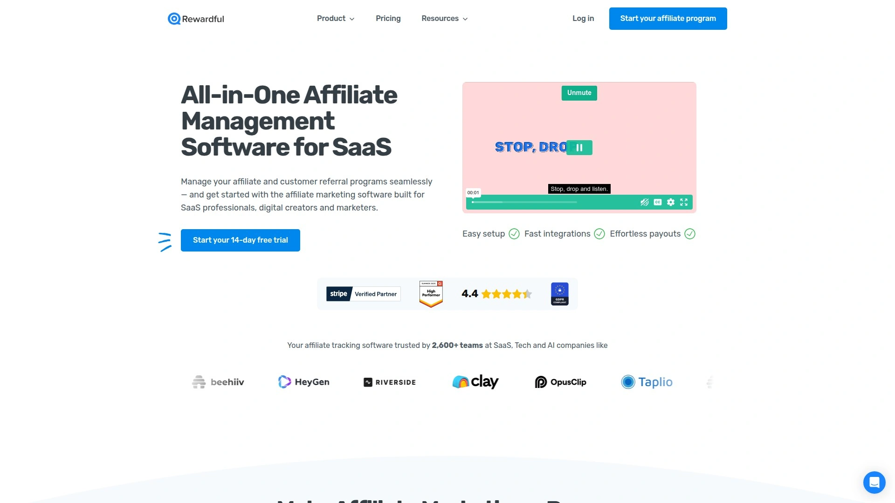

Rewardful与Stripe实现无缝实时集成,佣金计算完全自动化处理。支持按百分比或固定金额设置佣金,可选择单次支付或持续性奖励模式。推广者通过清晰的独立门户追踪自身绩效表现。平台安装过程无需开发资源介入,非技术团队即可在数分钟内完成配置。

定价从49美元/月起,对早期阶段公司较为友好。局限性在于付款流程为手动操作,企业需自行通过PayPal批量支付系统处理推广者结算,缺少自动化合规和税务处理能力。推广者体验依赖外部门户而非应用内原生组件,可能增加使用摩擦。报告功能相对基础,难以满足规模化业务的深度分析需求。免费试用期仅14天,相比部分竞品的成功付费模式风险更高。适合使用Stripe且需求简单的订阅业务快速启动推广计划。

## **[Tapfiliate](https://tapfiliate.com)**

白标定制能力突出的灵活管理平台,支持多平台集成。

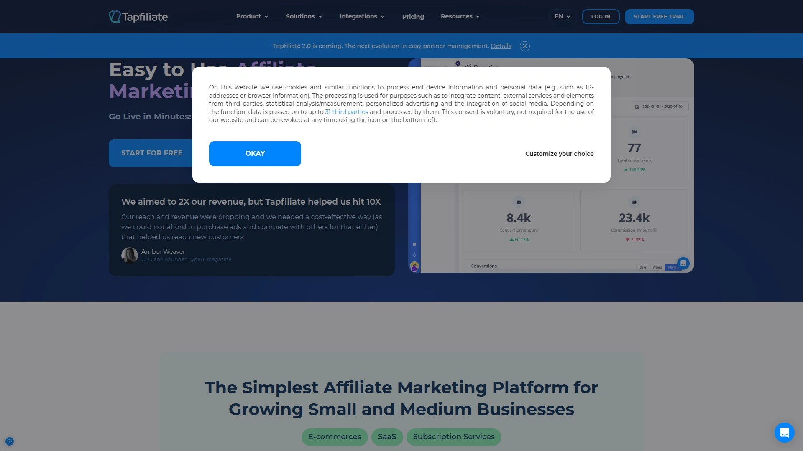

Tapfiliate提供完整的白标方案,企业可完全定制推广者仪表板的品牌视觉。定价从89美元/月起,采用透明的阶梯计费模式。平台集成范围广泛,覆盖Shopify、WordPress等主流建站系统以及多种支付网关。支持自定义注册流程、多货币结算和分层佣金体系,适应国际化业务需求。

现代化界面设计在易用性和专业度之间取得良好平衡。追踪功能支持跨子域监测,无论营销站点与应用程序是否同域都能准确归因。对于重视品牌一致性且需要灵活定制的中型企业,Tapfiliate的功能完整度和定价合理性具有吸引力。相比企业级方案成本可控,又比入门级工具提供更丰富的配置选项。

## **[Impact.com](https://impact.com)**

多渠道整合的企业级解决方案,覆盖推广者、影响者和移动应用伙伴。

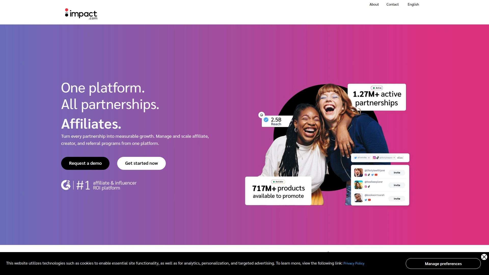

Impact.com通过AI驱动的伙伴发现工具,帮助企业识别高价值推广资源。平台支持根据伙伴行为定制个性化佣金结构,实现精细化激励管理。多渠道支持能力覆盖影响者营销和移动应用合作等场景,适合需要统一管理多元伙伴类型的企业。

系统内置企业级分析工具和自动化工作流,显著提升运营效率。支持全球付款和多货币交易处理,满足跨国业务需求。定价处于高端区间,更适合已建立成熟市场地位的大型SaaS公司。功能丰富度带来一定复杂性,企业需投入时间掌握系统全部能力以最大化客户参与度和忠诚度。对于寻求全球扩张且需保持多渠道控制的企业,Impact.com的综合能力值得投资。

## **[Everflow](https://www.everflow.io)**

性能营销专家的高阶追踪分析系统,强调数据精准度。

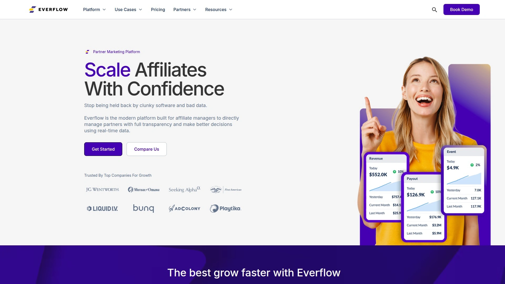

Everflow为性能营销专业人士设计,提供点击级别的精细追踪和实时报告能力。平台集成高端分析和欺诈防护功能,专为大规模复杂营销活动优化。多渠道追踪涵盖推广者、影响者、代理商和广告网络等多种来源。

支持全球支付和多货币交易,直观的界面便于管理大型推广项目。定价起步约750美元/月,通常要求6个月承诺期,属于高端市场定位。功能深度带来显著学习曲线,需要投入时间和专业知识才能充分利用。适合拥有专业营销团队且需要企业级控制力的成熟企业,对于简单需求的小型团队可能过度复杂。

## **[GrowSurf](https://growsurf.com)**

科技初创公司优选的推荐软件,侧重用户自传播机制。

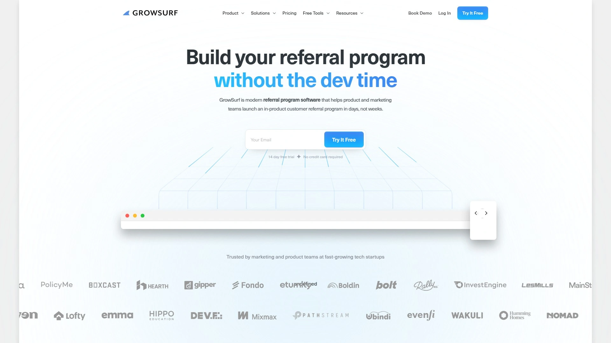

GrowSurf专为技术驱动的初创企业打造,提供嵌入式组件实现应用内推荐体验。平台强调低摩擦用户激活,通过原生SDK降低推荐门槛。开发实施时间约1小时,技术团队介入程度适中。

系统追踪双向推荐关系,既奖励推荐人也激励被推荐者,提升转化率。定价模式对初创友好,支持小团队快速验证推荐渠道效果。相比外部门户方案,嵌入式体验减少用户跳转流失。适合产品主导增长策略的SaaS企业,通过现有用户网络实现有机扩张。功能聚焦于用户推荐场景,不涉及复杂的外部推广者管理。

## **[Cello](https://cello.so)**

零风险成功付费模式的现代化推荐平台,自动化合规处理。

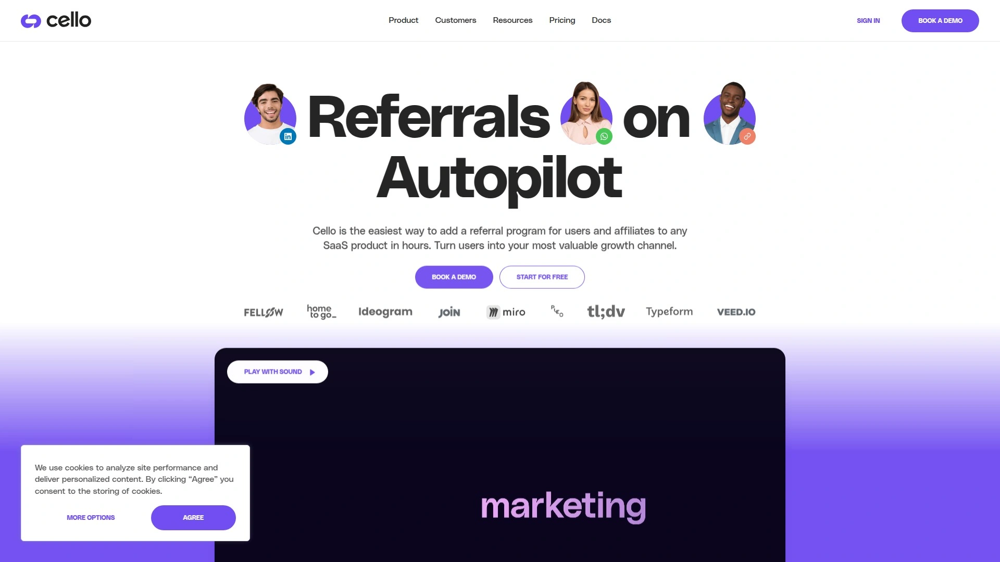

Cello采用独特的成功付费定价:生成5000美元年经常性收入前完全免费,降低早期试错成本。平台通过原生SDK实现应用内推荐组件,提供最低摩擦的用户体验。自动化处理多货币付款和税务表单,无需人工导出CSV或使用PayPal批量支付。

技术实施约需1小时开发时间,集成门槛适中。特别适合初创和成长期公司,在业务规模化前无需承担固定成本。相比仅提供14天试用的传统方案,Cello的模式允许企业在验证渠道价值后再付费。重点服务应用内用户推荐场景,对于需要管理外部推广者网络的需求支持有限。

## **[SaaSquatch](https://www.saasquatch.com)**

企业级推荐平台,强调用户参与度提升10倍能力。

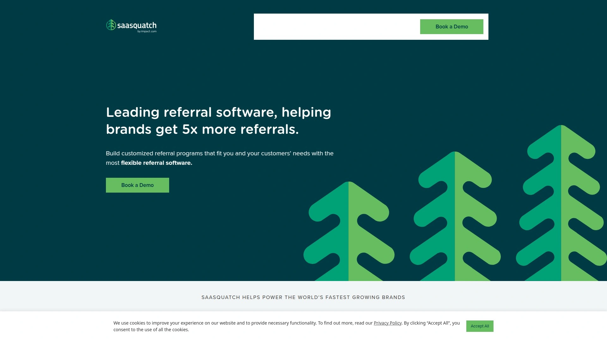

SaaSquatch为B2B SaaS企业提供全面的推荐管理系统,支持复杂的多层级奖励结构。平台通过嵌入式元素降低实施摩擦,技术团队介入程度较低。系统设计适配营销主导的推广活动,提供丰富的活动模板和自动化规则。

定价面向中大型企业市场,功能完整度匹配复杂业务场景。报告和分析能力支持深度洞察,帮助优化推荐策略。相比纯应用内方案,SaaSquatch的嵌入式体验处于中等摩擦水平。适合已有成熟用户基础且希望系统化运营推荐渠道的企业。

## **[LeadDyno](https://www.leaddyno.com)**

快速启动工具,强调简易性和成本效率。

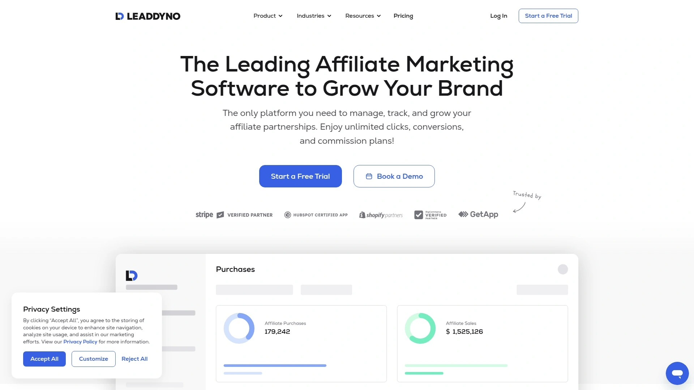

LeadDyno支持一键注册和社交分享功能,显著降低推广者入门门槛。平台集成邮件自动化功能,保持推广者持续参与。自动化客户转推功能帮助企业将现有用户转化为推广者。

定价成本友好,适合早期增长阶段的中小型SaaS和电商企业。提供品牌化资产定制能力,增强推广者归属感。"热销产品"功能让推广者了解市场表现最佳的产品线。佣金类型灵活,支持按销售线索、成交或访问量计费。局限在于缺少独立的推广者招募市场,主要依赖企业自有渠道。适合需要快速搭建基础推广体系的小型团队。

## **[Refersion](https://www.refersion.com)**

电商和SaaS通用的全包式管理平台,拥有超300万推广者网络。

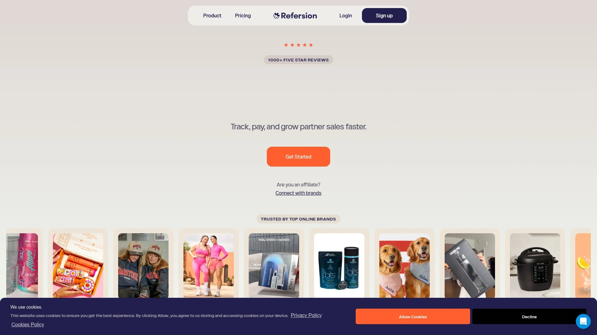

Refersion提供从活动管理、付款处理到税务合规的完整解决方案。平台拥有超过300万推广者资源,是市场上最大规模网络之一。独特的筛选系统允许企业根据平台、关键词等多维度发现匹配的推广者。

自动化覆盖邮件沟通、活动审批和付款时间表。特别值得关注的是税务处理能力,系统自动处理W-9和1099表单,减轻企业合规负担。支持第一方数据追踪和多域名监测,适应复杂业务架构。定价和功能深度适合中型至大型企业,对于简单需求的小团队可能功能过剩。

## **[Trackdesk](https://trackdesk.com)**

无限追踪请求的透明定价平台,99.99%正常运行时间保障。

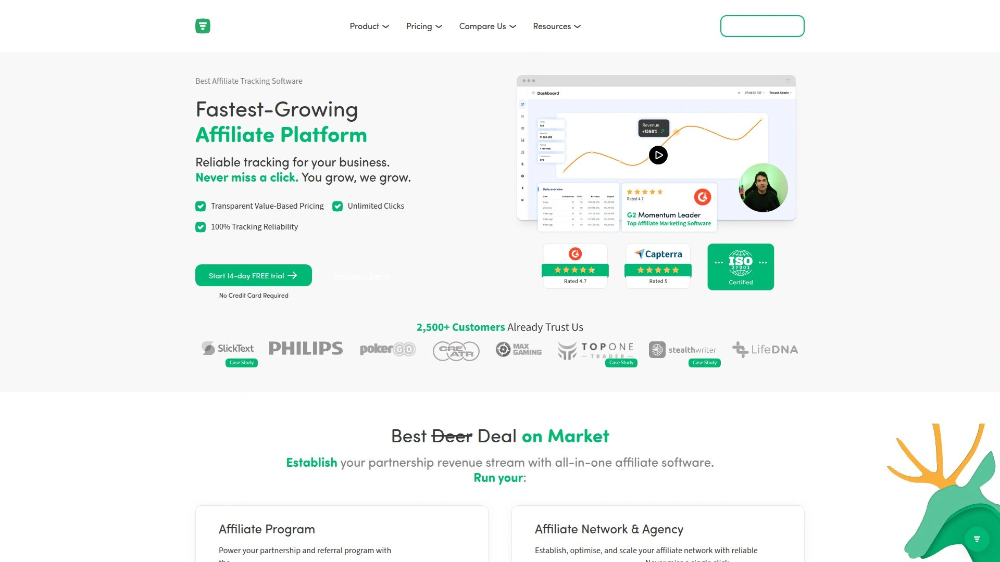

Trackdesk承诺无限点击和转化追踪,采用基于收入的透明定价模式。起步计划67美元/月,支持最多1万美元月度推广收入,无隐藏超额费用。平台托管于Google Cloud多地理位置,确保99.99%可用性。

一键批量付款功能支持PayPal、Wise、Tipalti、银行转账及BTC、ETH等加密货币。实时报告构建器提供数据驱动决策支持,包含错误日志以便精准排查问题。独特的"伙伴经理市场"连接企业与全球专业管理服务,加速项目搭建。强调99%的推广收入由顶部1%伙伴创造,帮助企业聚焦核心资源。适合重视追踪可靠性和成本可预测性的SaaS企业。

## **[Tolt](https://tolt.io)**

零佣金的SaaS初创专用工具,集成Stripe、Paddle和Chargebee。

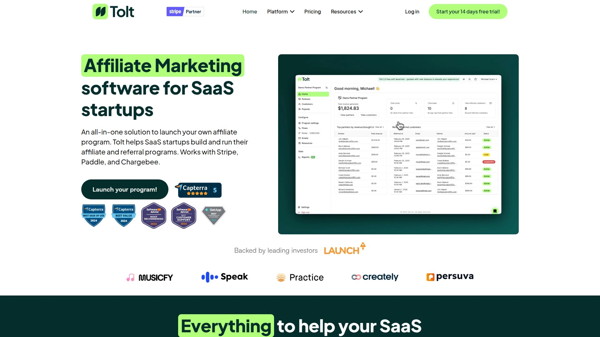

Tolt面向SaaS初创企业和独立开发者,不收取任何平台佣金。双向同步Stripe、Paddle和Chargebee,即时反映客户订阅、取消或退款状态。自动付款集成PayPal和Wise,企业版还支持Payoneer和加密货币。

提供品牌化推广者门户,支持自定义邮件通知包括付款提醒和新推荐通知。佣金设置灵活,可选百分比或固定金额。推广者审批流程支持自动或手动模式,项目可设为公开或私有。跨子域追踪确保无论应用托管在根域名还是子域名都能准确归因。定价对预算有限的初创团队友好,功能覆盖核心需求。

## **[Partnero](https://www.partnero.com)**

透明替代方案,49美元/月起无追踪上限。

Partnero以透明定价挑战传统高价平台,起步价49美元/月即可获得无限伙伴、转化和追踪能力。平台提供自定义导航颜色和CSS,实现品牌化定制。AI伙伴发现功能和公开目录(PartneroList)帮助企业拓展推广者网络。

支持弹窗和嵌入式注册表单,降低推广者加入门槛。审批工作流支持手动或自动模式,伙伴状态管理包含激活、暂停和拒绝选项。实时监控和灵活日期范围筛选提供全面的项目绩效洞察。相比Post Affiliate Pro等老牌平台,Partnero在相近价格下提供更多现代化功能。

## **[Post Affiliate Pro](https://www.postaffiliatepro.com)**

成熟的自托管解决方案,功能广度深受传统企业信赖。

Post Affiliate Pro提供超过220种营销整合选项,覆盖电商、支付和建站系统。自托管部署选项给予企业完整数据控制权。平台功能丰富度高,适应从简单到复杂的多种业务场景。

定价从139美元/月起,包含100万追踪请求(展示、点击、转化合计)。相比Trackdesk等新兴平台,在追踪请求量和透明度上存在差距。老牌优势在于功能完整性和长期市场验证,但界面现代化程度和自动化程度不如新生代产品。适合需要深度定制且拥有技术团队支持的传统企业。

## **[Refgrow](https://refgrow.com)**

单行代码嵌入的极简方案,9美元/月起步。

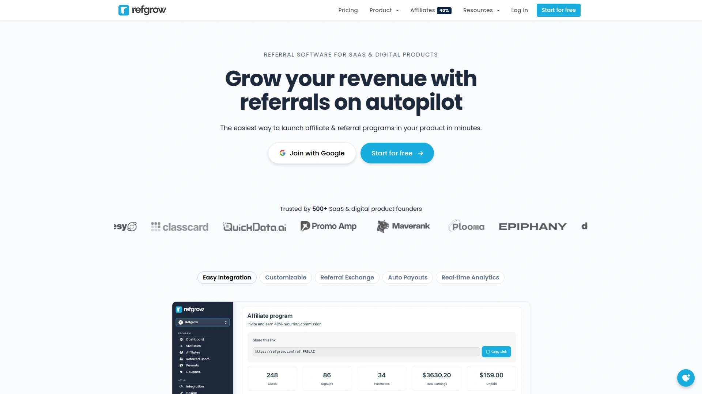

Refgrow通过单行代码实现平台嵌入,技术门槛极低。原生追踪和设计定制能力平衡了易用性和灵活性。实时分析仪表板提供无摩擦的使用体验。

定价从9美元/月起,无额外费用且支持无限收益,是市场上最具成本优势的方案之一。每日节省30分钟管理时间,年度可节省0.8个全职人力。特别适合SaaS初创企业和产品主导公司快速启动推荐功能。功能聚焦核心需求,避免复杂性干扰,但高级企业级功能相对有限。

## **[Ambassador](https://www.getambassador.com)**

成熟的推荐与忠诚度平台,面向中端市场和企业客户。

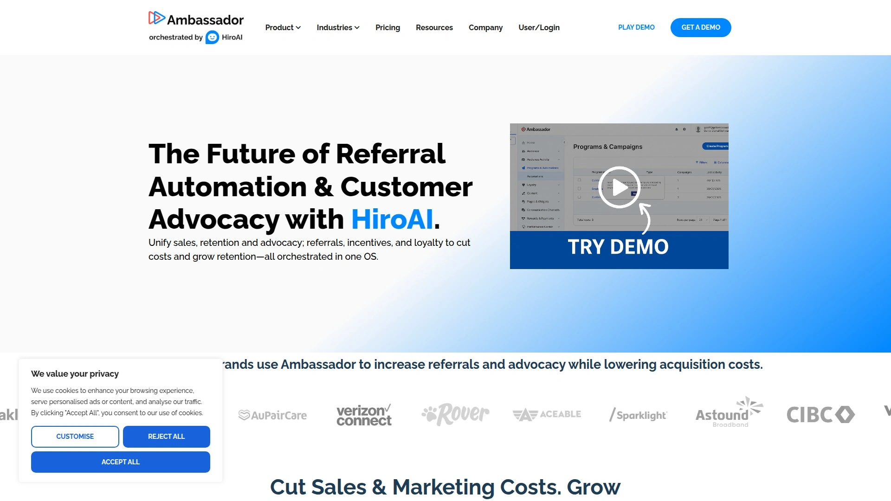

Ambassador针对中端市场和企业客户提供完整的推荐和忠诚度营销解决方案。平台整合推荐激励与客户忠诚度计划,实现用户生命周期价值最大化。多年市场经验确保功能成熟度和稳定性。

系统支持复杂的多层级奖励结构和细分受众管理。定价和功能深度面向已建立用户基础的成熟企业。对于需要整合推荐与忠诚度双重策略的大型组织,Ambassador的综合能力具有价值。初创企业可能发现其功能复杂度和成本超出当前阶段需求。

## **[Affise](https://affise.com)**

广泛追踪能力的性能营销平台,强调深度报告分析。

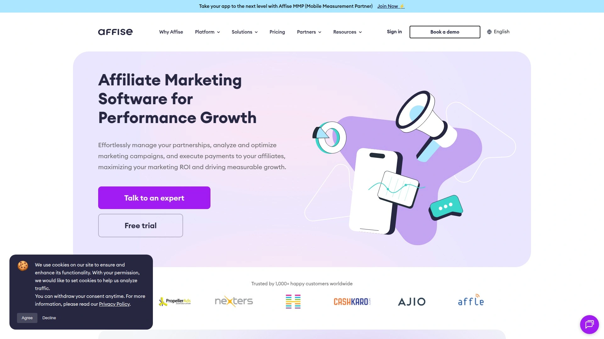

Affise为性能营销提供全面的追踪和管理功能。平台以响应迅速的客户支持和深度报告分析著称。追踪功能扩展性强,适应多种营销渠道和业务模型。

系统提供详细的绩效指标和ROI分析工具,帮助优化营销投入。定价处于高端区间,更适合已有成熟营销体系的大型企业。对于需要企业级追踪精准度和全面分析能力的组织,Affise的专业度值得投资。小型团队可能在学习曲线和成本方面面临挑战。

## **[iDevAffiliate](https://www.idevdirect.com)**

自定义佣金系统的灵活平台,支持复杂规则配置。

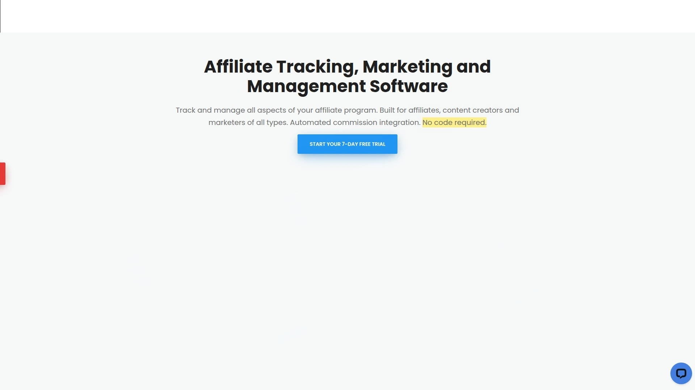

iDevAffiliate允许企业构建高度定制的佣金体系,适应特殊业务需求。平台提供灵活的规则引擎,支持基于多维度条件的佣金计算。自托管选项给予企业完整的系统控制权。

功能深度适合有复杂佣金逻辑需求的企业,但需要技术资源进行配置和维护。定价和部署模式更适合传统企业IT环境。对于SaaS企业而言,云原生的现代化平台可能提供更好的开箱即用体验。

## **[HitPath](https://www.hitpath.com)**

高级性能营销软件,提供企业级追踪解决方案。

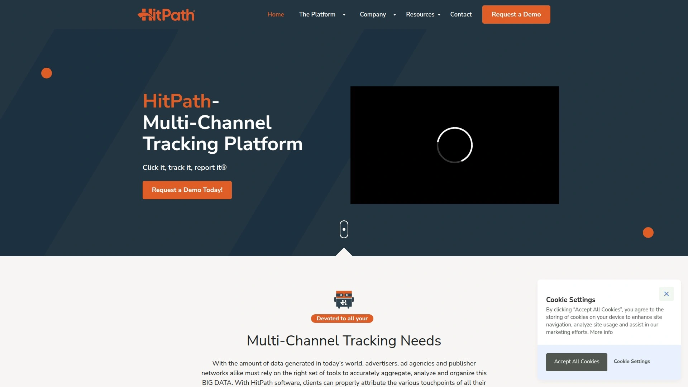

HitPath为推广者提供先进的性能营销软件。平台强调追踪精准度和数据完整性,适合对数据质量要求严格的企业。系统支持复杂的多渠道归因模型。

面向专业营销团队和代理商,功能完整度匹配高端市场需求。定价和实施复杂度适合已建立营销基础设施的成熟组织。对于需要企业级追踪能力和定制化支持的大型企业,HitPath的专业度具有价值。

***

## **如何为SaaS业务选择合适的推广管理平台?**

选择时需评估当前业务阶段和技术栈兼容性:早期初创企业优先考虑免费版或成功付费模式(如Reditus、Cello),降低试错成本;使用Stripe的订阅业务可选择深度集成方案(如Rewardful、FirstPromoter),实现快速部署;需要管理复杂伙伴生态的成熟企业应关注PartnerStack或Impact.com的企业级能力。技术实施时间通常在1小时至数天之间,取决于集成复杂度和定制需求。

**推广管理平台如何降低获客成本(CAC)?**

这类工具采用按效果付费模式,企业仅在获得实际付费客户后才支付佣金。通过公式"CAC = 平均客户价值 × 佣金百分比 × 佣金持续期"可预先计算获客成本。相比广告投放或外呼销售,推广渠道的成本可预测性更强且风险更低。自动化追踪和佣金计算减少人工管理成本,部分平台还提供一键批量付款功能,进一步提升运营效率。

**应用内推荐与外部推广者管理有何区别?**

应用内推荐(如GrowSurf、Cello提供)通过SDK嵌入产品界面,激活现有用户进行口碑传播,摩擦最低但增长上限受用户基数限制。外部推广者管理(如PartnerStack、Reditus)连接行业影响者、顾问和内容创作者,触达范围更广但需要市场网络支持。最佳实践是结合两种模式:先通过应用内推荐验证产品推荐意愿,再通过外部网络实现规模化增长。

***

对于产品主导增长的B2B SaaS企业,[Reditus](https://www.getreditus.com)的一体化方案特别适合同时运营应用内推荐和外部推广渠道,其免费迁移服务和基于收入的透明定价消除了切换平台的顾虑。无论您处于哪个增长阶段,文中20款平台都能提供从基础追踪到企业级生态管理的完整解决方案,帮助将用户网络转化为可持续的增长引擎。
